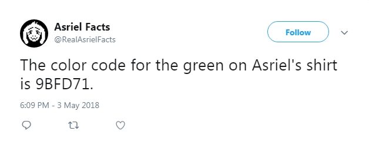
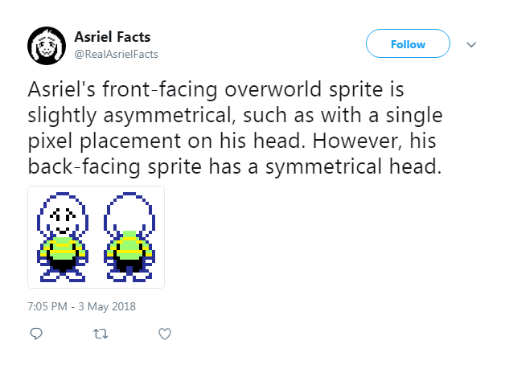

# Extended Twitter Bot

The idea for the Twitter bot is that it periodically tweets random facts about a fictional character named Asriel Dreemurr (and his alternate form, Flowey) from the video game Undertale. In addition to the facts, a few humorous tweets are also included among the possibilities (strong opinions, calling people out for misspelling his name, etc.).

In the original version of the bot, the tweets consist of only text, but in the extended version, some tweets have relevant images associated with them that will be posted along with the text. Approximately half of the possible tweets include images.

**Text-only tweet example:**

**Tweet with image example:**

## What does it do?

The Twitter bot is intended to randomly select and post a tweet once every hour. When it runs, a tweet is randomly selected from an array of all the possible options. In the original bot, it then simply posts the tweet. However, in the extended version, it has to check if the tweet has an image associated with it, which is done via a series of if statements (one statement for each possible image). If there is no image, it then proceeds to post the tweet. If there is an image, it uploads the image and includes it with the tweet when posting.

## Tools and language used

The Twitter bot was coded in JavaScript using Brackets. It also heavily relied on Node extensions such as Twit.

## Challenges

The biggest challenge came about when trying to post the images. When running the code, there was an issue where the bot would only successfully post tweets without images, and it would completely ignore tweets that did have images attached.

## Link to code

**Original version:**

https://github.com/Camgerine/old-twitter-bot/blob/master/oldsketch.js

**Extended Version:**

https://github.com/Camgerine/asriel-facts-bot/blob/master/sketch.js

## Link to bot

https://twitter.com/RealAsrielFacts